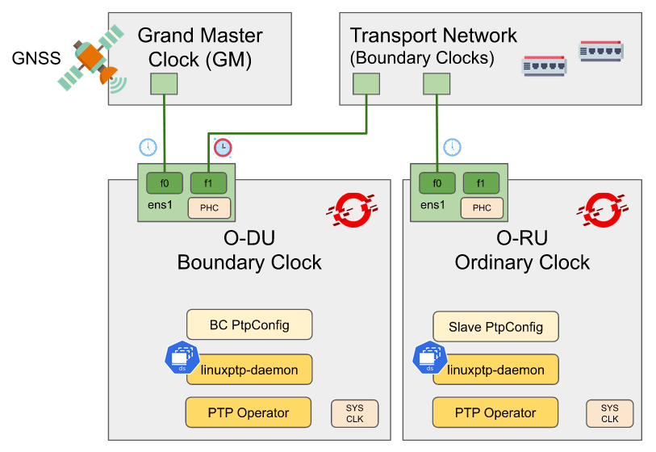

# Delivering High-Accuracy Clock Synchronization for 5G Networks with OpenShift

This is a series of two articles about the use of the PTP operator for delivering high-precision clock synchronization for low-latency 5G networks with OpenShift.

## Part 1: PTP Introduction

With the advent of 5G mobile deployments worldwide, diverse vertical sectors (e.g. automotive, media and entertainment, public safety, among others) are expecting to take advantage of the many features 5G networks have promised to deliver.

One of the protocols that play a crucial role in unlocking such low-latency in 5G deployments is the [IEEE 1588-2008](https://en.wikipedia.org/wiki/Precision_Time_Protocol) standard, which is also known as the Precision Time Protocol (PTP). In that direction, Red Hat has fully supported this technology [since the release of RHEL7](https://www.redhat.com/es/blog/precision-time-synchronization-network-latency).

Part 1 is published on the Red Hat [Open Hybrid Cloud blog](https://cloud.redhat.com/blog/delivering-high-precision-clock-synchronization-for-low-latency-5g-networks-with-openshift-part-1).

    

Hopefully, after this introduction to the PTP operator, users may find it easier to understand PTP technology within a cloud-native context. As well as being able to map traditional components of the Linux implementation into the PTP operator.

## Part 2: Way of Operation

In our [previous article](https://cloud.redhat.com/blog/delivering-high-precision-clock-synchronization-for-low-latency-5g-networks-with-openshift-part-1), we introduced the PTP technology and the main components of the PTP operator. In this part of the series, we focus on providing real examples of configuration from the main telecom profiles recommended for 5G O-RAN deployments. Furthermore, we also provide some insights on the way of operation, once the PTP operator is configured.

To demonstrate how the PTP operator works, we have prepared the following scenario. Specifically, we have rolled out two Single Node OpenShift (SNO) clusters using the [Zero Touch Provisioning (ZTP) workflow for RAN deployments](https://docs.openshift.com/container-platform/4.11/scalability_and_performance/ztp-deploying-disconnected.html).

Part 2 content can be found [here](docs/article-part-2.md) at the moment.

    

After this second article about the PTP operator, hopefully, users may find it easier to apply ITU-T telecom profiles in their 5G networks. Hence, be able to implement PTP in their O-RAN deployments, and meet the E2E sub-microsecond level accuracy requirements for timing and synchronization.

> By Leonardo Ochoa Aday and Carlos Cardeñosa
