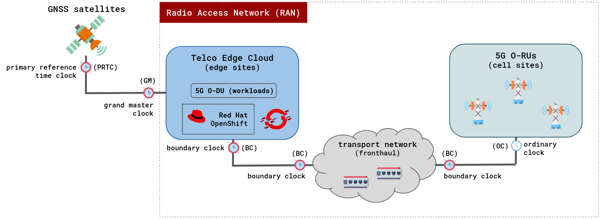

# Delivering High-Accuracy Clock Synchronization for 5G Networks with OpenShift - Part 1

> By Leonardo Ochoa Aday and Carlos Cardeñosa

With the advent of 5G mobile deployments worldwide, diverse vertical sectors (e.g. automotive, media and entertainment, public safety, among others) are expecting to take advantage of the many features 5G networks have promised to deliver.

One of the protocols that play a crucial role in unlocking such low-latency in 5G deployments is the [IEEE 1588-2008](https://en.wikipedia.org/wiki/Precision_Time_Protocol) standard, which is also known as the Precision Time Protocol (PTP). In that direction, Red Hat has fully supported this technology [since the release of RHEL7](https://www.redhat.com/es/blog/precision-time-synchronization-network-latency).

In Telco 5G environments, the use of this protocol is particularly relevant when deploying Radio Access Networks (RAN). Consequently, we have dedicated this article to provide an introduction to this technology in a cloud-native O-RAN scenario using OpenShift.

## Let’s jump right in

Currently, in Telco 5G deployments, the RAN components can be synchronized using diverse topologies. However, the O-RAN Specification WG4 has defined [four possible configurations](https://www.techplayon.com/o-ran-fronthaul-transport-synchronization-configurations/) (i.e. LLS-C[1-4]) for synchronization of transport fronthaul networks.

For the sake of simplicity, in this article, we have focused on presenting PTP profiles to synchronize the fronthaul transport network using Full Timing Support (FTS) in an LLS-C2 configuration. However, the PTP operator can also be configured to satisfy synchronization requirements in the other defined configurations.

In Figure 1, a high-level synchronization configuration using OpenShift in a cloud-native 5G RAN scenario is presented.

<p align="center">
   <br clear="left"/>
  <b>Figure 1:</b> High-level synchronization configuration in a cloud-native 5G RAN scenario using OpenShift.
</p>

Typically, in a PTP hierarchy we may find the following high-level components:

- **Grandmaster (GM) clock:** This is the primary reference time clock (PRTC) for the entire PTP network. It usually synchronizes its clock from an external Global Navigation Satellite System (GNSS) source.

- **Boundary clock (BC):** This intermediate device has multiple PTP-capable network connections to synchronize one network segment to another accurately. It synchronizes its clock to a master and serves as a time source for ordinary clocks.

- **Ordinary clock (OC):** By contrast to boundary clocks, this device only has a single PTP-capable network connection. Its main function is to synchronize its clock to a master, and in the event of losing its master, it may tolerate a loss of sync source for some period of time.

### Fronthaul transport network

The fronthaul transport network is expected to distribute high-precision time and frequency synchronization from the telco edge cloud to every ordinary clock located in O-RUs at the remote cell sites.

Typically, all network equipment (i.e. switches, etc.) implementing the fronthaul transport network are configured as BC. This scenario is defined by the [ITU-T profile G.8275.1](https://www.itu.int/rec/T-REC-G.8275.1), and known as Full Timing Support (FTS). This scenario is strongly recommended for an optimal O-RAN operation with the best accuracy results.

However, FTS configurations might be expensive for large networks. Hence, when not all the network equipment implementing the fronthaul segment supports PTP, we are in the face of a Partial Timing Support (PTS) scenario, defined by [ITU-T in the G.8275.2 profile](https://www.itu.int/rec/T-REC-G.8275.2).

For PTS scenarios, OpenShift also offers an alternative to fill this gap. On the one hand, it needs to be configured as BC. On the other, the switches that behave as passive elements should be configured to avoid filtering MAC PTP multicast frames. This can be simply accomplished by allowing the `01:1B:19:00:00:00` multicast MAC address to pass through all the switches’ interfaces.

> **Note:** The G.8275.1 and G.8275.2 profiles use the ITU-T clock types which are defined in the Telecom profiles, along with the performance specifications for each clock type. For the generality as well as to align with the LinuxPTP implementation's nomenclature, we use generic IEEE 1588 clock types throughout this document. For mappings and clarifications between the ITU-T clocks and IEEE clock types, please consult the associated ITU-T profile.

## A look inside the PTP operator

As with every day2 operator in OpenShift, the lifecycle of the PTP operator can be easily managed using OLM. Even though this operator handles cluster-wide PTP configurations, it is a namespaced operator.

Hence, when [deploying it via the CLI](https://docs.openshift.com/container-platform/4.10/networking/using-ptp.html#install-ptp-operator-cli_using-ptp), creating a namespace along with an operator group and subscription objects is recommended. If by contrast, you would prefer a more friendly interface like the OpenShift web console, a [procedure is also available](https://docs.openshift.com/container-platform/4.10/networking/using-ptp.html#install-ptp-operator-web-console_using-ptp) to achieve this.

Once the PTP operator is running on the cluster nodes where the O-RAN workloads will be hosted, we end up with a topology like the one presented in Figure 2.

<p align="center">
   <br clear="left"/>
  <b>Figure 2:</b> The anatomy of the PTP operator.
</p>

As shown in the figure, the PTP operator offers three Custom Resource Definition (CRD) objects, namely `NodePtpDevice`, `PtpConfig`, and `PtpOperatorConfig` resources. We will explore these resources deeply and provide some CRs for common PTP profiles in the following sections of this article.

These custom API resources provide a declarative approach, for the configuration of PTP profiles, to external components in the O-RAN Orchestration and Automation layer. Additionally, the PTP operator also deploys a `linuxptp` daemon with the PTP processes and configurations as required to support requested Telecom profile and clock type configurations.

Specifically, `NodePtpDevice` is responsible for discovering PTP-capable network devices in your cluster nodes. Meanwhile, the `PtpConfig` and `PtpOperatorConfig` resources directly interact with the `linuxptp` processes to properly apply PTP configurations.

### `linuxptp` components

The `linuxptp` software is a PTP implementation compliant with the IEEE standard 1588. It includes the `ptp4l` and `phc2sys` programs to manage the clock synchronization on each node belonging to the cluster. By default, the PTP operator runs these two as containers attached to a `linuxptp-daemon` pod. A sample of these two containers is provided below.

```shell
$ PTP_POD_NAME=$(oc get po -l app=linuxptp-daemon -oname)

$ oc -n openshift-ptp get po -l app=linuxptp-daemon

NAME                    READY   STATUS    RESTARTS   AGE
linuxptp-daemon-ccl8a   2/2     Running   0          3d18h

$ oc -n openshift-ptp rsh -c linuxptp-daemon-container ${PTP_POD_NAME} sh -c "ps -ef"
. . .
root     3592847 3590861  0 Jun21 ?        00:07:17 /usr/sbin/ptp4l -i ens1f0 -f /var/run/ptp4l.0.config -2 --summary_interval -4
root     3592855 3590861  0 Jun21 ?        00:00:19 /usr/sbin/phc2sys -a -r -n 24 -N 8 -R 16 -z /var/run/ptp4l.0.socket -t [ptp4l.0.config]
```

#### ptp4l

The `ptp4l` program represents the Linux implementation of PTP for the boundary and ordinary clocks. When using hardware timestamping, it directly synchronizes the PTP hardware clock (PHC) present on the NIC to the source clock.

In order to get a clearer view of the capabilities of this PTP implementation, we can inspect its help page using the below command.

```shell
$ oc -n openshift-ptp rsh -c linuxptp-daemon-container ${PTP_POD_NAME} ptp4l -h

usage: ptp4l [options]

 Delay Mechanism

 -A        Auto, starting with E2E
 -E        E2E, delay request-response (default)
 -P        P2P, peer delay mechanism

 Network Transport

 -2        IEEE 802.3
 -4        UDP IPV4 (default)
 -6        UDP IPV6

 Time Stamping
 -H        HARDWARE (default)
 -S        SOFTWARE
 -L        LEGACY HW

 Other Options

 -f [file] read configuration from 'file'
 -i [dev]  interface device to use, for example 'eth0'
           (may be specified multiple times)
 -p [dev]  PTP hardware clock device to use, default auto
           (ignored for SOFTWARE/LEGACY HW time stamping)
 -s        slave only mode (overrides configuration file)
 -t        transparent clock
 -l [num]  set the logging level to 'num'
 -m        print messages to stdout
 -q        do not print messages to the syslog
 -v        prints the software version and exits
 -h        prints this message and exits
```

If you are curious about the [`ptp4l` default configuration](https://docs.fedoraproject.org/en-US/fedora/latest/system-administrators-guide/servers/Configuring_PTP_Using_ptp4l/#sec-Specifying_a_Configuration_File), it can be found on the `ptp4l.conf` file, under the `/etc` directory. Also, when the `PtpConfig` CR is used, the `ptp4l` config is found under `/var/run/ptp4l.{0..n}.conf`. As a complement, we also provide a command to retrieve such information from the running container.

```shell
$ oc -n openshift-ptp rsh -c linuxptp-daemon-container ${PTP_POD_NAME} cat /etc/ptp4l.conf

[global]
#
# Default Data Set
#
twoStepFlag             1
slaveOnly               0
priority1               128
priority2               128
domainNumber            0
#utc_offset             37

. . . TRUNCATED . . . 
```

#### phc2sys

The `phc2sys` container is responsible for synchronizing the two available clocks in a cluster node, typically these are the PHC and the system clocks. This program is used when hardware time stamping is configured.

In such cases, it synchronizes the system clock from the PTP hardware clock on the defined network interface controller (NIC). Similar to `ptp4l`, we provide below the `phc2sys` help page showing its available options.

```shell
$ oc -n openshift-ptp rsh -c linuxptp-daemon-container ${PTP_POD_NAME} phc2sys -h

usage: phc2sys [options]


 automatic configuration:
 -a             turn on autoconfiguration
 -r             synchronize system (realtime) clock
                repeat -r to consider it also as a time source
 manual configuration:
 -c [dev|name]  slave clock (CLOCK_REALTIME)
 -d [dev]       master PPS device
 -s [dev|name]  master clock
 -O [offset]    slave-master time offset (0)
 -w             wait for ptp4l

common options:
 -f [file]      configuration file
 -E [pi|linreg] clock servo (pi)
 -P [kp]        proportional constant (0.7)
 -I [ki]        integration constant (0.3)
 -S [step]      step threshold (disabled)
 -F [step]      step threshold only on start (0.00002)
 -R [rate]      slave clock update rate in HZ (1.0)
 -N [num]       number of master clock readings per update (5)
 -L [limit]     sanity frequency limit in ppb (200000000)
 -M [num]       NTP SHM segment number (0)
 -u [num]       number of clock updates in summary stats (0)
 -n [num]       domain number (0)
 -x             apply leap seconds by servo instead of kernel
 -z [path]      server address for UDS (/var/run/ptp4l)
 -l [num]       set the logging level to 'num' (6)
 -t [tag]       add tag to log messages
 -m             print messages to stdout
 -q             do not print messages to the syslog
 -v             prints the software version and exits
 -h             prints this message and exits
```

If hardware timestamping is not available on NICs of the cluster nodes (i.e. a scenario with software timestamps), the `ptp4l` can be used to synchronize the system clock directly, without using `phc2sys`. 

This configuration is usually avoided in RAN use cases given that the accuracy error is relatively high. However, it may be useful on less demanding applications that are not in the critical synchronization path to O-DUs and/or O-RUs, such as for synchronization of the node clocks from PTP in nodes hosting O-CUs.

#### pmc

The PTP management client (`pmc`) is a tool that helps configure `ptp4l` at runtime. In that direction, it can be used to obtain additional information, as well as to perform advanced PTP tasks. This tool is also shipped within the `linuxptp-daemon` pod.

```shell
$ oc -n openshift-ptp rsh -c linuxptp-daemon-container ${PTP_POD_NAME} pmc -h

usage: pmc [options] [commands]

 Network Transport

 -2        IEEE 802.3
 -4        UDP IPV4 (default)
 -6        UDP IPV6
 -u        UDS local

 Other Options

 -b [num]  boundary hops, default 1
 -d [num]  domain number, default 0
 -f [file] read configuration from 'file'
 -h        prints this message and exits
 -i [dev]  interface device to use, default 'eth0'
           for network and '/var/run/pmc.$pid' for UDS.
 -s [path] server address for UDS, default '/var/run/ptp4l'.
 -t [hex]  transport specific field, default 0x0
 -v        prints the software version and exits
 -z        send zero length TLV values with the GET actions
```

### Clock references

Inside cluster nodes, we typically find two main clock references for synchronizing running workloads. Below, we present both and describe their primary interactions with each `linuxptp` component.

- **System clock:** This is the Operating System (OS) clock, also known as the software clock. It is managed by the Linux kernel and provides the time for system and application processes.

- **NICs clock:** Each NIC typically has its own clock, called Physical Hardware Clock (PHC) to obtain accurate timestamps of the packet reception and send events as close as possible to the Ethernet physical layer. The use of this clock eliminates timestamping inaccuracies caused by the Kernel scheduling and later processing.

To achieve high-precision clock synchronization, we strongly recommend configuring the PTP operator to use hardware timestamping.

## Conclusions

Hopefully, after this introduction to the PTP operator, users may find it easier to understand PTP technology within a cloud-native context. As well as being able to map traditional components of the Linux implementation into the PTP operator.

As production 5G mobile deployments roll out worldwide, large cell-site densification is becoming a reality for RAN deployments. Consequently, making the automation and orchestration that the cloud natively provides, of paramount importance to all journeys toward 5G.

In this regard, Red Hat's open source technologies have continuously demonstrated to be a reliable foundation (especially in multi-vendor scenarios) for such demanding 5G services.

In our [next article](https://cloud.redhat.com/blog/delivering-high-accuracy-clock-synchronization-for-5g-networks-with-openshift-part-2), we will concentrate on delivering real PTP configurations that fulfill the stringent requirements of the main telecom profiles recommended for O-RAN deployments. Moreover, we will also provide implementation details on how the PTP operator functions under the hood.
