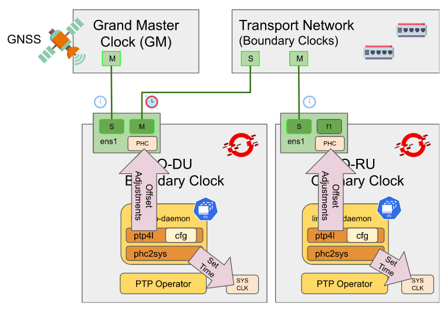

# Delivering High-Accuracy Clock Synchronization for 5G Networks with OpenShift - Part 2

> By Leonardo Ochoa Aday and Carlos Cardeñosa

Hardware-supported PTP can be configured in OpenShift using the [Red Hat PTP Operator](https://docs.openshift.com/container-platform/4.11/networking/using-ptp.html). This operator enables us to synchronize computer clocks, using hardware timestamps, over a network with sub-microsecond accuracy.

In our [previous article](https://cloud.redhat.com/blog/delivering-high-precision-clock-synchronization-for-low-latency-5g-networks-with-openshift-part-1), we introduced the PTP technology and the main components of the PTP operator. In this part of the series, we focus on providing real examples of configuration from the main telecom profiles recommended for 5G O-RAN deployments. Furthermore, we also provide some insights on the way of operation, once the PTP operator is configured.

## Let’s get in sync

To demonstrate how the PTP operator works, we have prepared the following scenario. Specifically, we have rolled out two Single Node OpenShift (SNO) clusters using the [Zero Touch Provisioning (ZTP) workflow for RAN deployments](https://docs.openshift.com/container-platform/4.11/scalability_and_performance/ztp-deploying-disconnected.html).

Even though PTP topologies may be different depending on the timing and synchronization requirements at O-RAN deployments, we have selected this sample scenario primarily for demonstration purposes. In this regard, we'll show how SNO clusters could be configured as ordinary, and boundary clock modes respectively.

<p align="center">
   <br clear="left"/>
  <b>Figure 1:</b> SNO clusters to be synchronized by the PTP operator using a GM source.
</p>

Once we have deployed the SNO clusters using the RAN ZTP workflow, we have used [custom resource policies](https://docs.openshift.com/container-platform/4.11/scalability_and_performance/ztp-deploying-disconnected.html#ztp-ztp-custom-resources_ztp-deploying-disconnected) that automatically handle the PTP operator deployment for us. The two baremetal servers used comprise one NIC with two ports each, sharing the same PHC.

The main goal of this section is to synchronize all PHCs in the network using the specialized GNSS source clock as the GM for timing. While doing so, we will also describe how to configure boundary and ordinary clock modes for both clusters, respectively.

## Prerequisites

Prior to starting to configure the PTP operator using its CRs, there are some prerequisites that the target OpenShift clusters need to fulfill first.

### Disabling NTP

Since PTP is going to be the method for distributing time and synchronization across the RAN network, we need to ensure that NTP is disabled on each cluster node that will use PTP. By default, NTP uses `chronyd` as a daemon time service.

Hence, to disable `chrony` using OpenShift objects, a `MachineConfig` for each node in our clusters needs to be applied. The technique to [disable `chrony` time service](https://docs.openshift.com/container-platform/4.11/post_installation_configuration/machine-configuration-tasks.html#cnf-disable-chronyd_post-install-machine-configuration-tasks) is also described in the OpenShift documentation.

### Assign labels to nodes

After disabling the NTP service, the next thing is to properly assign labels to the cluster nodes. By doing so we ensure that the PTP operator applies created PTP profiles to the right cluster node.

The use of labels facilitates in-cluster object searches, which are leveraged by the PTP operator (using a match field) to select the right cluster nodes and configure the `ptp4l` and `phc2sys` programs accordingly.

Sample commands used to assign labels to SNO clusters previously presented in Figure 1 are provided below.

```shell
$ oc label node rh-sno-du ptp/boundary-clock=""             # <- context: rh-sno-du cluster
```

```shell
$ oc label node rh-sno-ru ptp/ordinary-clock=""             # <- context: rh-sno-ru cluster
```

## Telecom profiles

Profiles enable tuning PTP for specific synchronization and timing requirements. They group a defined combination of options and attribute values. In Table 1, we provide the PTP attributes for the two main telco profiles recommended for O-RAN in Telco UCs.

<p align="center">
   <br clear="left"/>
  <b>Table 1:</b> PTP attributes for the ITU-T G.8275.1 and G.8275.2 profiles.
</p>

Since our priority in this article is to provide guidelines for the best PTP performance, we will focus next on providing `PtpConfig` snippets to cope with the requirements defined in profile G.8275.1. For both modes of operation, the boundary and ordinary clock modes.

Nonetheless, a similar approach can also be followed to translate the attributes defined by the G.8275.2 profile into a `PtpConfig` resource.

## PTP custom resources

We are now in a good spot to start configuring the PTP subsystem. In modern cloud-native environments for Telcos, a dedicated Kubernetes operator automates the configuration of the underlying infrastructure using CRDs. Following this pattern, we now proceed to prepare those offered by the [PTP operator](https://github.com/openshift/ptp-operator).

### NodePtpDevice

When configuring clock synchronization for high-precision using hardware timestamping, the first question to answer is whether there are any PTP-capable network devices in your cluster nodes. To precisely answer this question the `NodePtpDevice` resource can be used.

To confirm NICs that are present in your cluster nodes support hardware timestamps, just inspect the status of this resource. A sample of how this object looks can be found below.

```shell
$ oc get nodeptpdevices.ptp.openshift.io rh-sno-du -o yaml

apiVersion: ptp.openshift.io/v1
kind: NodePtpDevice
metadata:
  generation: 1
  name: rh-sno-du
  namespace: openshift-ptp
spec: {}
status:
  devices:
  - name: ens1f0
  - name: ens1f1
```

### PtpOperatorConfig

The `PtpOperatorConfig` custom resource has two main functionalities when configuring the PTP operator. On one hand, it creates a default object that can be used to configure on which cluster nodes the `linuxptp` daemon should be deployed.

The name of this configurable option is `daemonNodeSelector`, and a sample of the default object is shown below. This default object is automatically created once the PTP operator is running on the cluster.

On the other hand, the `PtpOperatorConfig` default object can also be used to enable PTP fast notifications using the [cloud-event framework](https://github.com/redhat-cne/cloud-event-proxy). This is particularly suitable for any O-RAN application (e.g. DUs, etc.) that requires low-latency event notifications about PTP state changes like clock out of sync, clock class change, or port failures.

```shell
$ oc get ptpoperatorconfigs.ptp.openshift.io default -n openshift-ptp -o yaml

apiVersion: ptp.openshift.io/v1
kind: PtpOperatorConfig
metadata:
  name: default
  namespace: openshift-ptp
spec:
  daemonNodeSelector:                             # <- configurable option
    node-role.kubernetes.io/worker: ""
  ptpEventConfig:
    enableEventPublisher: true
    transportHost: "amqp://amq-router.amq-router.svc.cluster.local"
```

### PtpConfig

The `PtpConfig` custom resource is the object available to configure the PTP profile we would like to implement. This CR governs the way both `ptp4l` and `phc2sys` programs operate on each cluster node where the PTP operator is running.

From the Openshift point of view, the profile to be assigned to a particular node is embedded into a `PtpConfig` CR along with additional `phc2sys`. So depending on the settings, we specify on the `PtpConfig` resource, we may configure the `linuxptp` service to act as a boundary or an ordinary clock.

Following the scenario in Figure 1, we provide below a skeleton of the `PtpConfig` object that could be applied to configure the deployed SNO clusters.

```shell
$ cat << EOF | oc create -f -
apiVersion: ptp.openshift.io/v1
kind: PtpConfig
metadata:
  name: <ptp-config-name>
  namespace: openshift-ptp
spec:
  profile:
  - name: <ptp-profile-name>
    interface: <ptp-capable-interface>
    . . . REDACTED . . . 
    phc2sysOpts: <phc2sys-cmd-options>
    ptp4lOpts: <ptp4l-cmd-options>
    ptp4lConf: |
      [global]
      . . . REDACTED . . . 
  recommend:
  - profile: <ptp-profile-name>
    priority: 4
    match:
    - nodeLabel: <ptp-label-selector>
EOF
```

As shown in above example, the `ptp4l` and `phc2sys` programs can be configured either using command options (i.e. `phc2sysOpts` and `ptp4lOpts`), or specifying a desired state in the `ptp4lConf` configuration file. Both are specified under the `spec.profile` field.

This custom resource also comprises a list of profiles under the `spec.recommend` path. It has the match field the PTP operator will use to apply the created profile in the node specified by the label assigned in the previous subsection.

#### Command-line options

Many arguments can be specified here, however, the arguments used in our described scenario for `ptp4lOpts` and `phc2sysOpts`, are shown below. The content of the `ptp4l` config file is also mapped to those values typed in the `ptp4lConf` field.

```shell
$ cat << EOF | oc create -f -
apiVersion: ptp.openshift.io/v1
kind: PtpConfig
metadata:
  name: <ptp-config-name>
  namespace: openshift-ptp
spec:
  profile:
  - name: <ptp-profile-name>
    interface: ens1f0
    . . . REDACTED . . . 
    phc2sysOpts: "-a -r -n 24 -N 8 -R 16"
    ptp4lOpts: "-2 --summary_interval -4"
    ptp4lConf: |
      [global]
      . . . REDACTED . . . 
  recommend:
  - profile: <ptp-profile-name>
    priority: 4
    match:
    - nodeLabel: <ptp-label-selector>
EOF
```

To corroborate the passed arguments to both processes, below, we provide a sample command to verify it inside the `linuxptp-daemon-container`, when configured as an ordinary clock.

```shell
$ oc -n openshift-ptp rsh -c linuxptp-daemon-container ${PTP_POD_NAME} sh -c "ps -ef"
. . .
root     3592847 3590861  0 Jun21 ?        00:07:17 /usr/sbin/ptp4l -i ens1f0 -f /var/run/ptp4l.0.config -2 --summary_interval -4
root     3592855 3590861  0 Jun21 ?        00:00:19 /usr/sbin/phc2sys -a -r -n 24 -N 8 -R 16 -z /var/run/ptp4l.0.socket -t [ptp4l.0.config]

oc -n openshift-ptp rsh -c linuxptp-daemon-container ${PTP_POD_NAME} sh -c "head /var/run/ptp4l.0.config"

 [global]
```

#### Domain Number

This PTP attribute allows multiple clock distribution systems to share the same communications medium. For FTS profiles, valid values for this attribute range from 24 to 43. In this example, we have used default domain number 24. 

It is important to highlight that the `domainNumber` configured for `ptp4l`, needs to match the `phc2sys` domain number option (-n). Otherwise, `phc2sys` won't be able to read the PHC offsets from the `ptp4l` program.

```shell
$ cat << EOF | oc create -f -
. . . REDACTED . . .
    phc2sysOpts: "-a -r -n 24"
    . . . REDACTED . . . 
    ptp4lConf: |
      [global]

      # Valid domain G.8275.1 (FTS) profile are: 24 to 43
      domainNumber                      24

. . . REDACTED . . . 
EOF
```

#### PTP Packet Rates

The PTP packet rate is configured following the established by the G.8275.1 profile. Specifically, it defines the mean message rate of Sync and Delay-Req-Resp messages to be 16 packets-per-second, and 8 packets-per-second for the case of Announce messages.

```shell
$ cat << EOF | oc create -f -
. . . REDACTED . . . 
    ptp4lConf: |
      [global]
      . . . REDACTED . . . 
      #
      # Port Data Set
      #
      # The mean time interval between Announce messages.
      # A shorter interval makes ptp4l react faster to the
      # changes in the master-slave hierarchy.
      # The interval should be the same in the whole
      # domain. It's specified as a power of two in
      # seconds.
      # The default is 1 (2 seconds).
      logAnnounceInterval    -3 # <-- Announce 8 packets-per-second
      announceReceiptTimeout  3 # Announce Time Out Interval
                                # be set longer than the Announce Interval
      # The mean time interval between Sync messages.
      # A shorter interval may improve accuracy of the
      # local clock. It's specified as a power of two
      # in seconds.
      # The default is 0 (1 second).
      # Note: This value must be the same selected in
      # "--summary_interval -4" parameter
      logSyncInterval         -4 # <-- Sync 16 packets-per-second
      logMinDelayReqInterval  -4 # <-- Delay-Req-Resp 16 packets-per-second
      syncReceiptTimeout       0 # Sync Time Out Interval
                                 # be set longer than the Sync Interval
. . . REDACTED . . . 
EOF
```

#### Transport

The transport attribute is expected to use PTP over Ethernet Multicast in order to cope with the timing and synchronization requirements defined for the FTS scenario.

The FTS profile recommends the End-2-End E2E measure mechanism to calculate the offsets. This is configured in our scenario as shown in the following snip.

```shell
$ cat << EOF | oc create -f -
. . . REDACTED . . . 
    ptp4lConf: |
      [global]
      . . . REDACTED . . .
      #
      # Default interface options
      #
      . . . REDACTED . . . 
      network_transport      L2  # PTP over Ethernet Multicast
      delay_mechanism        E2E # default value
      #
      # Transport options
      #
      ptp_dst_mac          01:1B:19:00:00:00 # Ethernet Multicast for E2E delay
      p2p_dst_mac          01:80:C2:00:00:0E # Use for P2P delay mechanism
. . . REDACTED . . . 
EOF
```

The same result can be obtained by setting the `ptp4lOpts` field with -2 and -E options (-E could be omitted since it is the default value).

> **Note:** Arguments set via the command line will always have preference over those specified directly in the `ptp4l` config file.

```shell
. . . REDACTED . . . 
    phc2sysOpts: "-a -r -n 24 -N 8 -R 16"
    ptp4lOpts: "-2 -E --summary_interval -4"
    ptp4lConf: |
. . . REDACTED . . . 
```

#### Ordinary Clock specific configs

When specifying the clock mode to operate, possible values can be specified. Specifically, "OC" is used to configure ordinary clocks, "BC" for boundary clocks, "P2P_TC" for peer-to-peer transparent clocks, and "E2E_TC" for end-to-end transparent clocks.

> **Note:** The G.8275.1 profile defines PTP hierarchies containing at least one GM clock (typically specialized high-precision hardware), with boundary and ordinary slave clocks. By contrast, peer-to-peer transparent clocks are not permitted to form part of this PTP hierarchy.

As shown in Figure 1, the SNO cluster hosting the Remote Unit (RU) will be configured as an ordinary clock in the PTP hierarchy. Therefore, this cluster node will adjust its PHC from the upstream BC master port.

To achieve so, it is possible to force this clock mode by setting the `slaveOnly` field. This will set its NIC port to act as a slave port so that it won’t send `Announce` messages to be eligible as the master port.

```shell
spec:
  profile:
  - name: "slave"
    interface: ens1f0
    . . . REDACTED . . . 
    ptp4lConf: |
      [global]
      . . . REDACTED . . .
      #
      # Default interface options
      #
      clock_type OC
      slaveOnly 1
      . . . REDACTED . . .
  recommend:
  - profile: "slave"
    priority: 4
    match:
    - nodeLabel: ptp/slave
```

#### Boundary Clock specific configs

Despite the fact that the `clock_type` field has "OC" as the default value, every multi-port ordinary clock will be configured as a boundary clock automatically by the PTP operator.

The main goal of the `masterOnly` option is to provide support for the following Telecom profiles ITU-T G.8265.1, G.8275.1, and G.8275.2. On one hand, BC ports that are expected to operate in slave mode, should be left configured using its default value of zero (i.e. false).

On the other hand, when set to one, it not only prevents the BC port from entering into a slave state, but also makes the local clock ignore any `Announce` message received on this port.

```shell
spec:
  profile:
  - name: boundary-clock
    . . . REDACTED . . . 
    ptp4lConf: |
      # Same NIC (ens1) sharing the same PHC
      # different ports (f0, f1)
      [ens1f0]
      # This interface is to be fixed as SLAVE, receiving timestamps
      # form a upstream MASTER port to adjust its PHC
      masterOnly             0
      [ens1f1]
      # This interface is to be fixed as MASTER, sending current timestamp
      # from its PHC to downstream MASTER ports
      masterOnly             1
      [global]
      . . . REDACTED . . .
      # This time the clock type is a Boundary Clock
      clock_type             BC
      . . . REDACTED . . .
      # This option allows ptp4l to work as a
      # boundary clock using "just a bunch of devices"
      # that are not synchronized to each other. For this
      # mode, the collection of clocks must be
      # synchronized by an external program, for example
      # phc2sys(8) in "automatic" mode.
      # The default is 0 (disabled).
      boundary_clock_jbod    0
      . . . REDACTED . . .
  recommend:
  - profile: boundary-clock
    priority: 10
    match:
    - nodeLabel: ptp/bc
```

It is also possible to have a node, acting as a BC, with two different NICs and its corresponding PHCs be synced through the `phc2sys` program. To allow this behavior the `boundary_clock_jbod` option must be enabled (i.e. set to one).

However, such a setup is not acceptable in the fronthaul RAN case as it prevents fulfillment with G.8273.2 Class-C Max. Absolute Time Error (`max|TE|`) requirement (not greater than 30 ns) due to the added errors from having to handle such synchronization via software. Hence, to cope with synchronization requirements defined in the FTS profile, we should keep its default disable value for Boundary Clock configurations.

#### Other interesting attributes

There are some extra profile options that are worth mentioning as they must be considered when implementing the Telco profiles.

The [twoStepFlag option](https://blog.meinbergglobal.com/2013/10/28/one-step-two-step/) instructs `ptp4l` to send a follow-up message right after the sync message conveying T1 timestamps. However, if the T1 timestamp values were included in the sync messages subsequent (i.e. FU) messages wouldn't be necessary. In any case, NIC support at the hardware level is needed to support the one-step timestamping mode.

```shell
      # The local clock is a two-step clock if enabled.
      # The default is 1 (enabled).
      twoStepFlag                       1
```

Another attribute that might be important to highlight, especially when troubleshooting PTP configurations, is the `logging_level`. Values for this attribute increase from zero to seven.

```shell
      #
      # Run time options
      #
      logging_level                    6
```

Some other extra settings have to do with RT-Kernel, Fast Event Notifications, and settings for Intel Columbiaville NIC hardware. Check out the [OpenShift documentation](https://docs.openshift.com/container-platform/4.11/networking/using-ptp.html#nw-columbiaville-ptp-config-refererence_using-ptp) for further details, and this [knowledge article](https://access.redhat.com/articles/6954499) for a matrix of supported NICs.

## Way of operation

Once the PTP operator detects the `PTPConfig` resource, it starts the `ptp4l` and `phc2sys` processes following the attributes specified in the applied manifest.

### Initialization

Under the hood, the PTP operator embeds all the settings defined under the `ptp4lConf` section of the CR, into a `ptp4l.conf` file. Then, it uses this config file to initialize the `ptp4l` program, as shown in the logs below.

```shell
I0607 09:17:03.024466 1139919 ptpdev.go:20] PTP capable NICs: [ens1f0 ens1f1]
I0607 09:17:32.745894 1139919 main.go:111] ticker pull
I0607 09:17:32.746088 1139919 config.go:58] load profiles
I0607 09:17:32.746103 1139919 daemon.go:132] in applyNodePTPProfiles
I0607 09:17:32.746106 1139919 daemon.go:154] updating NodePTPProfiles to:
I0607 09:17:32.746225 1139919 daemon.go:191] ------------------------------------
I0607 09:17:32.746228 1139919 daemon.go:202] applyNodePtpProfile: not starting phc2sys, phc2sysOpts is empty
I0607 09:17:32.746269 1139919 daemon.go:286] /bin/chrt -f 32 /usr/sbin/ptp4l -f /var/run/ptp4l.0.config -2 --summary_interval -4 -m
I0607 09:17:32.746295 1139919 metrics.go:427] adding -m to print messages to stdout for phc2sys to use prometheus exporter
I0607 09:17:32.746298 1139919 metrics.go:443] adding -m to print messages to stdout for ptp4l to use prometheus exporter
I0607 09:17:32.746362 1139919 daemon.go:183] ------------------------------------
I0607 09:17:32.746366 1139919 daemon.go:120] Profile Name: vdu-node-ptpconfig
I0607 09:17:32.746369 1139919 daemon.go:120] Interface: ens1f0,ens1f1
I0607 09:17:32.746371 1139919 daemon.go:120] Ptp4lOpts: -2 --summary_interval -4 -m
I0607 09:17:32.746373 1139919 daemon.go:120] Ptp4lConf:
 [ens1f0]
 masterOnly  0
 [ens1f1]
 masterOnly  1
 [global]
 time_stamping           hardware
 ptp_dst_mac           01:1B:19:00:00:00
. . .
I0607 09:17:34.747513 1139919 daemon.go:317] Starting phc2sys...
I0607 09:17:34.747587 1139919 daemon.go:318] phc2sys cmd: /bin/chrt -f 32 /usr/sbin/phc2sys -a -r -n 24 -N 8 -R 16 -u 0 -m -z /var/run/ptp4l.1.socket -t [ptp4l.1.config]

. . . TRUNCATED . . . 
```

Meanwhile, the role of the `phc2sys` program is solely reserved for communicating with the `ptp4l` program to adjust the system clock from the PHC, when hardware timestamping is used.

### PTP hierarchy

As soon as the `ptp4l` program is up and running, it starts determining each NIC port's role based on the `PTPConfig` CR definition and using the [Best Master Clock Algorithm](https://blog.meinbergglobal.com/2013/11/14/makes-master-best/) (BMCA). As a result, all NIC ports within each cluster node get a role on the PTP hierarchy.

It is worth highlighting that the G.8275.1 profile uses an Alternate BMCA, which differs from the default BMCA. For instance, the Alternate BMCA considers the per-port Boolean attribute `masterOnly`. If `masterOnly` is set to TRUE, that port would never transition into a slave state, and will always go to the master state. If by contrast, the `masterOnly` is set to FALSE, the port can be moved into a slave state.

> **Note:** The capability of setting NIC port roles statically was introduced by the [G.8275.1 profile](https://www.itu.int/rec/T-REC-G.8275.1-202003-I/en#:~:text=E%C2%A043687-,PDF%20(acrobat),-1537442%20bytes). Its predecessor, the [G.8265 profile](https://www.itu.int/rec/T-REC-G.8265), does not provide the ability to set NIC port roles statically. This critical feature enables each port in cluster nodes to be configured with a given role on the PTP hierarchy.

### Synchronization process

Generally, upon receiving PTP messages, the PHC at the cluster nodes will first set the timestamps using a hardware timestamp unit (TSU) present in the receiving NIC. Once that operation is completed, the `ptp4l` then uses a servo algorithm to adjust the phase (synchronization) and frequency (syntonization) of the underlying PHC.

Although the phase and frequency (of master ports) are critical for slave ports in order to keep the offset between hardware clocks at a minimum, the PTP protocol only propagates timestamps values and not the frequency/phase adjustments.

The timestamp values are communicated with 2-step PTP through four messages, namely `Sync`, `Follow-up` (2-step only), `Delay_Req`, and `Delay_Resp` messages. Meanwhile, the adjustments stay in box and are calculated again by `ptp4l` using its servo algorithm on the active receiving slave port.

In Figure 2, the GM device sends its timestamps downstream and these are received in the boundary clock slave ports (denoted in the image with a capital S). These timestamps are then used by `ptp4l` to adjust the local PHC in the corresponding cluster node.

<p align="center">
   <br clear="left"/>
  <b>Figure 2:</b> High-level synchronization process in SNO clusters using the PTP operator.
</p>

Once PTP port roles are determined, whether master or slave, the BC's master ports are used to synchronize the PHCs belonging to NIC slave ports of downstream nodes.

Therefore, the NIC ports that have been established as the master PTP port, start sending [`Sync` messages](https://en.wikipedia.org/wiki/Precision_Time_Protocol#Synchronization) throughout the master ports. These messages are replied to, by the slave ports, in order to adjust the time offset between them.

> **Note:** As soon as a NIC port of a BC is selected as a master port, it starts sending multicast `Sync`/`Follow-up` (`Follow-ups` when using 2-step operation) messages downstream. Afterward, another port belonging to the same NIC is selected as a slave port and starts adjusting its PHC offset from the upstream clock. The newer timestamp values will be taken by master ports to be sent downstream, keeping the whole hierarchy up to sync.

At the same time, the `phc2sys` process running in both the O-DU and O-RU nodes will read the PHC timestamps from the `ptp4l` program through a shared [Unix Domain Socket](https://en.wikipedia.org/wiki/Unix_domain_socket) (UDS) and finally adjust the `SYSTEM_CLOCK` offset, as shown in Figure 2.

This process is continuously repeated in order to keep all the PHC in the O-RAN deployment effectively synchronized to the GNSS source clock, which is acting as the GM in this scenario.

## Conclusions

After this second article about the PTP operator, hopefully, users may find it easier to apply ITU-T telecom profiles in their 5G networks. Hence, be able to implement PTP in their O-RAN deployments, and meet the E2E sub-microsecond level accuracy requirements for timing and synchronization.

Many stakeholders across the telecom ecosystem have identified the development of open interfaces and technologies that power telco RAN deployments, as vital in their journeys towards 5G. As a result of integrating open-source solutions, their 5G networks will greatly benefit from an upstream of open innovation and also a rapid adoption.

In this direction, Red Hat has continuously proved to be a respected steward in open-source communities. In the case of PTP, fostering not only the development of this technology in both, kernel and cloud-native initiatives like the PTP operator, but also putting efforts into bridging any other gap in key networking features that aim to unlock open 5G deployments worldwide.
